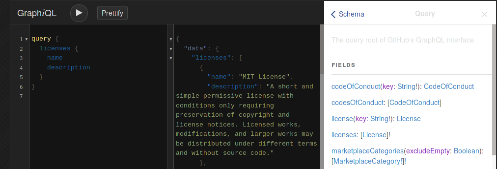
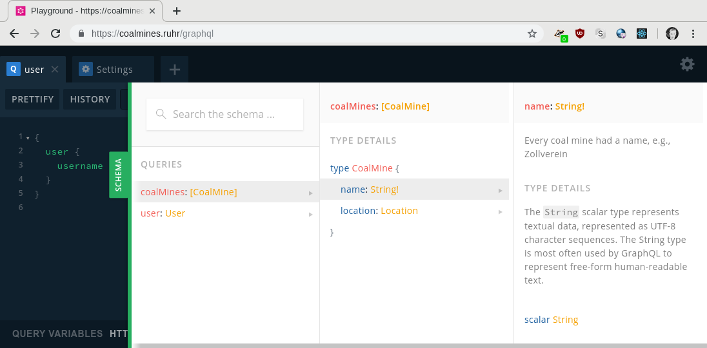
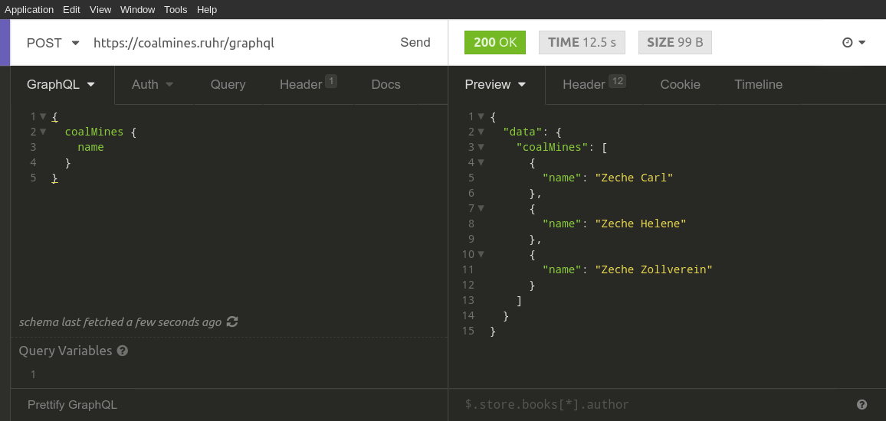

class: center, middle

# A JavaScript GraphQL Stack Built With Apollo

[](https://apollographql.com)

Daniel Maslowski |
 [@orangecms](https://twitter.com/orangecms) |
 [orangecms](https://github.com/orangecms)

---

# ToC

1. Introduction to GraphQL
2. RPC Architectures
3. GraphQL Clients
4. GraphQL Schemas
5. Testing
6. Logging and Monitoring

---

class: center, middle

## Introduction to GraphQL

---

### GraphQL


--

* a query language for APIs
* views queries as graphs 🤷
* provides predictable results
* has a built-in type system
* [spec](http://facebook.github.io/graphql/October2016/) is a working draft

---

### Example Query

--

```graphql
query {
  coalMines {
    name
    location {
      address
      zipCode
      city
    }
  }
}
```

--

* fields: a coal mine may have a lot of data, e.g.:
  - name
  - location
  - website
  - shutdown date
* relation: every location can hold a reference to a geo API like OSM

---

### Example Response

```json
{
  "data": {
    "coalMines": [
      {
        "name": "Zeche Carl",
        "location": {
          "address": "Wilhelm-Nieswandt-Allee 100",
          "zipCode": "45326",
          "city": "Essen"
        }
      },
      {
        "name": "Zeche Helene",
        "location": {
          "address": "Twentmannstraße 125",
          "zipCode": "45326",
          "city": "Essen"
        }
      },
      {
        "name": "Zeche Zollverein",
        "location": {
          "address": "Gelsenkirchener Str. 181",
          "zipCode": "45309",
          "city": "Essen"
        }
      }
    ]
  }
}
```

---

class: center, middle

## RPC Architectures

---

### Handling Remote Procedure Calls

--


* Input Validation

--


* Authentication

--


* Authorization

--


* Operation

--


* Output Validation

---

### Input and Output Validation

--


* should happen on every layer (API, application logic, DB, ...)

--


* provided through GraphQL's type system

---

### Authentication


--


* makes the app stateful

--


* requires session and/or token middleware or similar

--


* adds a security context to requests

--


* existing library: [Passport](http://www.passportjs.org/docs/)
  - [session middleware](https://mherman.org/blog/user-authentication-with-passport-and-koa/)
  - [JWT middleware](https://dev.to/hasusozam/passport-jwt-with-graphql-3gdj)

--

#### Integration example with Koa and Passport session
```javascript
function passContext({ ctx }) {
  if (ctx.session.passport) {
    const { user } = ctx.session.passport;
    return { user };
  }
  return {};
}

const server = new ApolloServer({
  schema,
  context: passContext,
});
```

---

### GraphQL Operations

#### [In Current Spec](http://facebook.github.io/graphql/October2016/#sec-Executing-Operations)

* Request-Response
  - `Query` (request that only fetches data)
  - `Mutation` (optional, request that may manipulate data)

--

#### [In Proposal](https://github.com/facebook/graphql/blob/master/rfcs/)

* Publish-Subscribe
  - `Subscription` (client registers for receiving data continuously)

---

### Backend Requirements

* HTTP server, e.g., koa 🎲
* Websocket support for subscriptions
* body parser middleware
* session middleware
* authentication middleware
* router middleware

---

class: center, middle

## GraphQL Clients

---

### GraphiQL

--


* query editor with auto-completion and syntax highlighting
* automatic schema exploration via introspection queries
* can be used as a React component and served through middleware

--

```javascript
router.get('/graphiql', graphiqlMiddleware({ endpointURL: '/graphql' }));
```

--



---

### GraphQL Playground

--


* similar to GraphiQL, but with more features
* included in [Apollo Server 2](https://www.apollographql.com/docs/apollo-server/whats-new.html#GraphQL-Playground)
* currently not sending cookies by default because of a
[bug](https://github.com/prisma/graphql-playground/issues/748#issuecomment-412524510)

--



---

### Insomnia

* portable desktop REST client built with Electron
* supports GraphQL queries and introspection



---

class: center, middle

## [GraphQL Schemas](https://www.apollographql.com/docs/apollo-server/essentials/schema.html)

---

### Type Definitions


--

* Schema Definition Language
  - graphql-tag (allows syntax highlighting)
  - precompiled (`*.graphql`, best performance)
  - export strings (documentation is a prepended hash `# foo`)


--

* [programmatic](https://www.apollographql.com/docs/apollo-server/migration-two-dot.html#schema-object-notation) (hand-crafted, yay)


--


* `Query`, `Mutation`, `Subscription`

--

* scalars
  - basic types for type definitions
  - primitives like `String` are predefined
  - [custom scalars](https://www.apollographql.com/docs/apollo-server/features/scalars-enums.html) can be defined and added, such as `Date`
  - Apollo Server 2 [includes an `Upload` scalar](https://www.apollographql.com/docs/apollo-server/whats-new.html#File-Uploads)


--


* `scalar`, `type`, `interface`, `union`, `enum`, `input`

--


* [documentation](https://facebook.github.io/graphql/draft/#sec-Documentation) for introspection

---

### Resolvers

  - requests to other services
  - transformations
  - directives
    * [predefined directives](https://www.apollographql.com/docs/apollo-server/features/directives.html) exist, e.g., `@deprecated`
    * [custom directives](https://www.apollographql.com/docs/apollo-server/features/directives.html#Using-custom-schema-directives) can be defined
    * useful for common functionality such as general access controls

---

### Composition

* [Introspection queries](https://graphqlmastery.com/blog/graphql-introspection-and-introspection-queries)
  - disabled in Apollo Server 2 by default, enable through `introspection` flag
* type definitions and resolvers can be merged, respectively
* schemas can be
  - [delegated](https://www.apollographql.com/docs/graphql-tools/schema-delegation.html)
  - namespaced ([transformed](https://www.apollographql.com/docs/apollo-server/api/graphql-tools.html#Transform))
  - merged ([stitched](https://www.apollographql.com/docs/graphql-tools/schema-stitching.html))
  - [extended](https://www.apollographql.com/docs/graphql-tools/generate-schema.html#extend-types)

---

class: center, middle

## Testing

---

### Unit Testing

* suitable for transformations
* run fast, offline, without extra dependencies
* provide fixtures for responses from other services
* test can be run in parallel
* simple assertion library like Mocha or the default `assert` module suffices

---

### Integration & Service Testing

* run an instance of the GraphQL API service
* [stub out external dependencies](https://www.apollographql.com/docs/apollo-server/whats-new.html#Schema-mocking) (used by resolvers)
* provide fixtures for responses to the requests to other services
* assert that a query receives a response or an error as intended
* use Apollo Client to make the requests
* stub for authentication

---

### Error Types

--

* operational errors
  - expected
  - need to be exposed
  - can accumulate: GraphQL returns a list of errors
  - may require individual action from the client

--


* programmatic errors
  - unexpected
  - should remain internal

---

### Error Occurrences

--


* web server setup
* authentication
* resolvers (authorization and other services)

--


* proposal:
  * try/catch around transformations
  * generate UUID
  * log UUID and error with stack trace
  * throw new error with UUID as reference

---

### [Predefined in Apollo Server 2](https://www.apollographql.com/docs/apollo-server/whats-new.html#GraphQL-errors)

* ApolloError
* ForbiddenError
* AuthenticationError

---

class: center, middle

## Logging and Monitoring

---

### [Logging](https://www.apollographql.com/docs/apollo-server/features/metrics.html#Logging)

* log incoming requests for auditability: who is doing what?
  - do *not* log sensitive information
* [`makeExecutableSchema`](https://www.apollographql.com/docs/apollo-server/api/graphql-tools.html#makeExecutableSchema) takes a `logger` as an optional argument
  - logger has to implement a function `log`
* experimental extensions API in Apollo Server 2

--

#### Simple logging library

```js
import getenv from 'getenv';
import bunyan from 'bunyan';
import { ConsoleLogger } from '@cdm-logger/server';

const isProduction = getenv('NODE_ENV', 'development') === 'production';

export default (name) => {
  const logger = (isProduction
    ? bunyan.createLogger({ name })
    : ConsoleLogger.create(name)
  );
  // Apollo requires logger.log for error logging support
  logger.log = logger.error;
  return logger;
}
```

---

### Health Check

* important for Site Reliability Engineers to determine basic status
* tyipically displayed by SaaS providers at `status.example.com`
* [ITEF draft](https://tools.ietf.org/id/draft-inadarei-api-health-check-01.html)
* built into Apollo Server 2 on `/.well-known/apollo/server-health`

---

### Monitoring With [Apollo Engine](https://www.apollographql.com/engine)


--

* UI with dashboard is a [hosted service](http://engine.apollographql.com/)


--

* [Engine Proxy](https://www.apollographql.com/docs/engine/#engine-proxy) comes as a binary written in Go


--

* can be run as
  - middleware that spawns a child process, [included in Apollo Server 2](https://www.apollographql.com/docs/apollo-server/whats-new.html#Performance-monitoring)
  - a container in a service landscape


--

* performance tracing and error tracking
  - requires tracing extension from GrahQL API
  - recommends compression middleware
  - extensions can be filtered out for the client with `formatResponse`


--

* schema usage analysis


--

* response caching and persisted queries

---

class: center, middle
# Thanks, that's it! 😸
