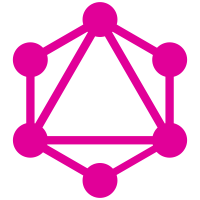

class: center, middle

# A JavaScript GraphQL Stack Built With Apollo

[](https://apollographql.com)

Daniel Maslowski |
 [@orangecms](https://twitter.com/orangecms) |
 [orangecms](https://github.com/orangecms)

---

# ToC

1. Introduction to GraphQL
2. RPC Architectures
3. Graphiql Frontend
4. Tooling and Testing
5. Logging and Monitoring

---

class: center, middle

## Introduction to GraphQL

---

### GraphQL



--

* a query language for APIs
* views queries as graphs 🤷
* provides predictable results
* has a built-in type system
* [spec](http://facebook.github.io/graphql/October2016/) is a working draft

---

### Example Query

--

```graphql
query {
  coalMines {
    name
    location {
      address
      zipCode
      city
    }
  }
}
```

--

* fields: a coal mine may have a lot of data, e.g.:
  - name
  - location
  - website
  - shutdown date
* relation: every location can hold a reference to a geo API like OSM

---

### Example Response

```json
{
  "data": {
    "coalMines": [
      {
        "name": "Zeche Carl",
        "location": {
          "address": "Wilhelm-Nieswandt-Allee 100",
          "zipCode": "45326",
          "city": "Essen"
        }
      },
      {
        "name": "Zeche Helene",
        "location": {
          "address": "Twentmannstraße 125",
          "zipCode": "45326",
          "city": "Essen"
        }
      },
      {
        "name": "Zeche Zollverein",
        "location": {
          "address": "Gelsenkirchener Str. 181",
          "zipCode": "45309",
          "city": "Essen"
        }
      }
    ]
  }
}
```

---

class: center, middle

## RPC Architectures

---

class: center, middle

## Graphiql Frontend

---

class: center, middle

## Tooling and Testing

---

class: center, middle

## Logging and Monitoring

---

class: center, middle
# Thanks, that's it! 😸
